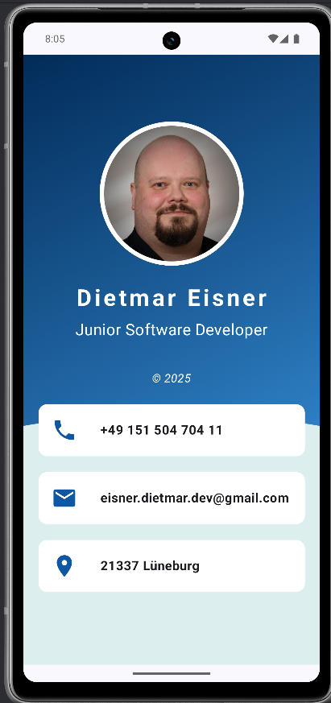

# 📇 BusinessCardApp - Jetpack Compose Projekt

Erstellt im Rahmen von **Unit 1 - Android Basics with Compose**  
Ziel: Entwicklung einer digitalen Visitenkarte mit modernen UI-Komponenten in Jetpack Compose

---

## 🖼️ Screenshot

---

## 🧩 Projektbeschreibung

Die BusinessCardApp ist eine minimalistische Android-App, die eine persönliche Visitenkarte visuell darstellt. Die App zeigt:

- Ein rundes Profilbild
- Namen und Jobtitel
- Kontaktdaten wie Telefonnummer, E-Mail und Standort
- Ein modernes UI mit einem sanften **Farbverlauf im Hintergrund**
- Eine dynamisch geformte Fläche am unteren Bildschirmbereich mittels `GenericShape`

---

## 🌟 Highlights & eigene Erweiterungen

| Bereich              | Beschreibung                                                                 |
|----------------------|-------------------------------------------------------------------------------|
| 🎨 Gradient-Brush     | Einsatz von `Brush.linearGradient` zur Gestaltung eines stufenlosen Farbübergangs von einem dunklen zu einem helleren Blau |
| 🌀 Custom Shape       | Eigenes Shape erstellt mit `GenericShape` und Bézierkurve (`cubicTo`) – nutzt mathematische Kurven zur Formgebung |
| 🧱 Box-Verständnis    | Erweiterte Nutzung von `Box` für Layering, Hintergrund und Z-Index-Verständnis |
| 🎯 Compose-Komponenten | Effizienter Einsatz von `Column`, `Row`, `Spacer`, `Image`, `Icon`, `Text` usw. |

---

## 📚 Gelernt (über die Aufgabenstellung hinaus)

- Erstellung und Anwendung von **eigenen Formen** via `cubicTo`
- Verständnis, wie `Brush` funktioniert, wozu es dient und wie man es in Modifiern verwendet
- Kombination von `Modifier.clip()`, `zIndex()` und `background()` zur präzisen UI-Gestaltung
- Verbesserung meines Verständnisses über die `Box`-Komponente und ihre vielseitigen Layout-Möglichkeiten

---

## 📦 Tech Stack

- **Sprache:** Kotlin
- **Framework:** Jetpack Compose
- **Zielplattform:** Android (API 30+)
- **Tools:** Android Studio, Material 3

---

## 🔧 Build & Run

1. Projekt in Android Studio öffnen
2. Emulator oder echtes Gerät wählen
3. App starten via "Run" ▶️

---

Erstellt von: **Dietmar Eisner**  
Teil des Kurses: *Android Basics with Compose (Unit 1)*  
