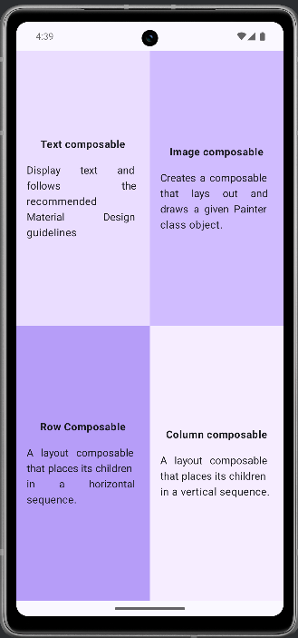

# 🧭 [Compose Quadrant](./Composequadrant/)

Vier gleich große UI-Abschnitte mit je einer kurzen Beschreibung.  
Schwerpunkt: **Grid-Struktur**, **Verwendung von `Row` und `Column`**, **gleichmäßige Verteilung mit `weight`**

---

## 📸 Screenshots

---

[🔙](../)