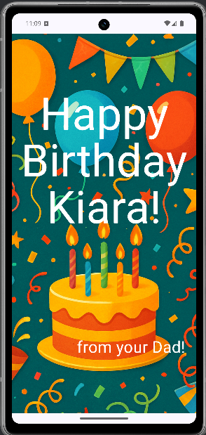
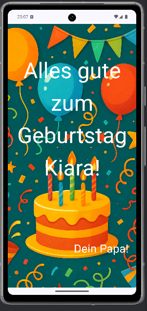

# 🥳 Birthday Card App

Dies ist mein zweites Jetpack Compose Projekt, erweitert im Rahmen des Android-Kurses:
👉 [Android Basics with Compose - Unit 1, Pathway 3](https://developer.android.com/codelabs/basic-android-kotlin-compose-add-images?continue=https%3A%2F%2Fdeveloper.android.com%2Fcourses%2Fpathways%2Fandroid-basics-compose-unit-1-pathway-3%23codelab-https%3A%2F%2Fdeveloper.android.com%2Fcodelabs%2Fbasic-android-kotlin-compose-add-images#0)

## 🎯 Ziel des Projekts

_Ziel dieser App ist es, eine Geburtstagskarte mit Text und einem Hintergrundbild darzustellen.
Dabei werden zentrale Jetpack Compose-Konzepte eingesetzt:_

- Verwendung von `@Composable`-Funktionen

- Aufbau eines UI mit `setContent()`

- Integration von Bildern mit `Image()`

- Verwendung von `Modifier` zur Layout-Anpassung

- Nutzung von `Scaffold` und `Box` für geschichtetes Layout

- Dynamisches UI in Abhängigkeit von der eingestellten Sprache

## 🛠️ Features
- Dynamische Sprachunterstützung (Englisch & Deutsch)

- Automatische Textgrößenanpassung abhängig von der Sprache

- Anzeige eines Hintergrundbildes mit Image()

- Zentrale Grußbotschaft in zwei Zeilen

- Kompatibel mit Jetpack Compose Material 3

- Saubere UI-Komponentenstruktur (GreetingText, GreetingBackgroundImage etc.)

## 🧪 Sprachabhängige Anpassungen
_Das Projekt erkennt automatisch die Systemsprache (z. B. Deutsch oder Englisch) und passt folgende Dinge dynamisch an:_

- Textgröße der Grußnachricht (`fontSize`)

- Inhalt von `message` und `from` über `strings.xml`

## 📸 Screenshots

|🇺🇸 English (Spracheinstellung: Englisch)|🇩🇪 Deutsch (Spracheinstellung: Deutsch)|
|---|---|
|||

🧠 Learnings
- Wie Bilder in Compose integriert werden (`painterResource`)

- Wie man Texte lokalisiert (`strings.xml` in `values-de/values`)

- Wie UI-Elemente sprachabhängig angepasst werden

- Grundlagen von Composable-Funktionen und UI-Hierarchien

- Dynamische `Modifier`-Nutzung für Layout und Design