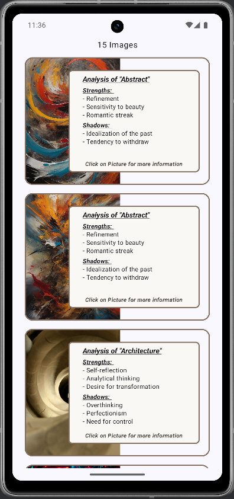
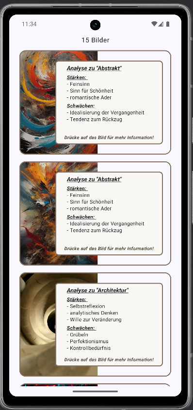
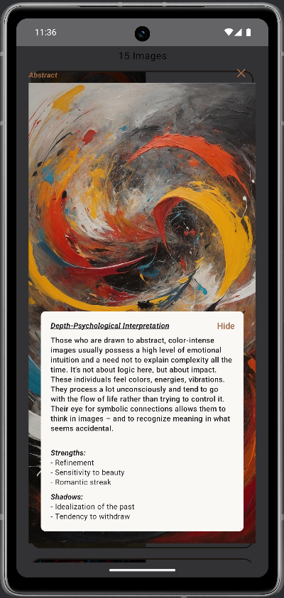
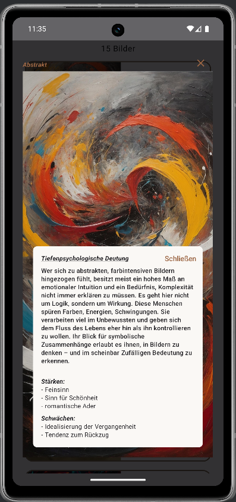
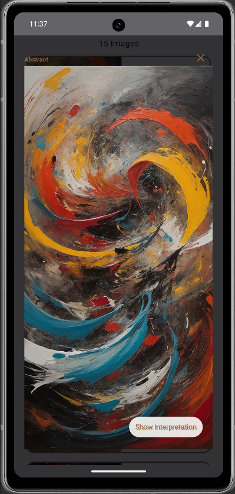
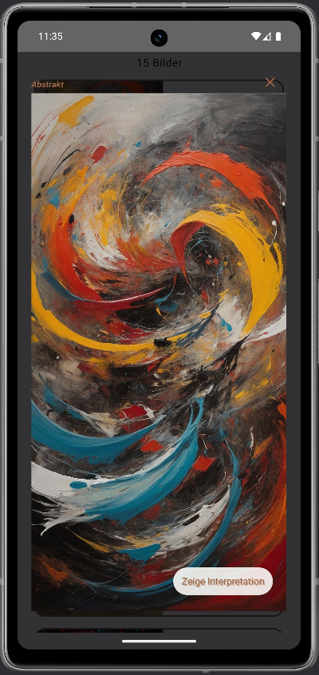

# 🎨 Artwork Space App

Dies ist mein Jetpack Compose Projekt, entwickelt im Rahmen der [Android Basics in Kotlin - Compose Reihe von Google](https://developer.android.com/codelabs/basic-android-kotlin-compose-art-space).

## 🚀 Ziel

Die App präsentiert eine interaktive Galerie mit verschiedenen Kunstwerken.  
Nutzerinnen und Nutzer können:

- durch eine scrollbare Liste von Werken navigieren
- Kategorien, Titel, Stärken und Schattenseiten jedes Werkes ansehen
- ein Bild per Klick im Vollbildmodus mit detaillierter Analyse öffnen
- die Interpretation ein- und ausblenden, um den Fokus auf das Kunstwerk zu legen

## 🛠️ Verwendete Technologien

- **Jetpack Compose** für deklarative UI-Entwicklung
- **Material 3 Komponenten** (`Scaffold`, `Text`, `IconButton`, `Dialog`, `LazyColumn`)
- **State Management** mit `remember` und `mutableStateOf`
- **Custom Composables** wie `GalleryItem`, `FullScreenImage`, `CardInDialog` und `StyledText`
- **LazyColumn** für performantes, scrollbares Laden von Galerieelementen
- **Dialoge** im Vollbild mit `DialogProperties` und benutzerdefiniertem Layout
- **Ressourcenbindung** mit `stringResource`, `pluralStringResource` und `painterResource`
- **Wiederverwendbare UI-Bausteine** für konsistente Gestaltung

## 🧪 Automatisierte Tests

> Dieses Projekt wurde als visuell-interaktive Übung konzipiert.  
> Das Hauptaugenmerk lag auf UI-Umsetzung und State-Handling – automatisierte Tests sind hier nicht Bestandteil des Codelabs, können aber für Composable-UI und Logik leicht ergänzt werden.

Mögliche Testideen:

- **UI-Tests** mit `createComposeRule()`, um zu prüfen:
  - ob beim Klick auf ein Galerie-Item der Vollbilddialog erscheint
  - ob der Wechsel zwischen „Interpretation anzeigen/verbergen“ korrekt funktioniert
- **Unit Tests** für Hilfsfunktionen (z. B. Datenquellen oder Ressourcenzuordnung)

## 🔍 Lerneffekte

- Tieferes Verständnis für **State Management** in einer mehrstufigen UI
- Praktischer Einsatz von **Composable-Navigation** innerhalb einer einzigen Activity
- Umsetzung eines **Vollbilddialogs** mit interaktiven Bedienelementen
- Dynamische Ressourcennutzung mit **Strings**, **Arrays** und **Drawables**
- Gestaltung von **wiederverwendbaren Composables** für mehr Konsistenz
- Anwendung von **Material Design**-Prinzipien in Compose

## 📸 Vorschau

| Englisch | Deutsch |
|---|---|
|| | 
|||
|||

---

➡️ Basierend auf dem offiziellen [Codelab von Google](https://developer.android.com/codelabs/basic-android-kotlin-compose-art-space) umgesetzt.  
💡 Erweiterbar mit Filter- oder Suchfunktionen, zusätzlichen Bildkategorien und Favoritenlisten.
