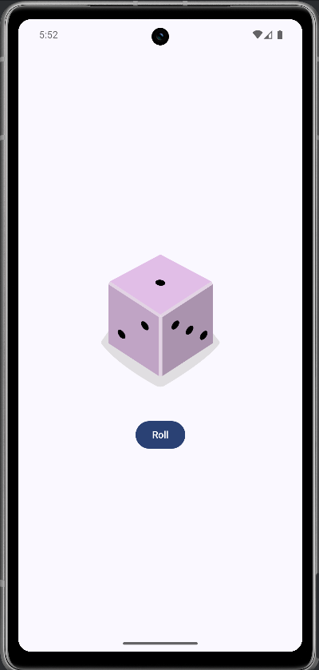

# 🎲 Dice Roller App

Dies ist mein Jetpack Compose Projekt, entwickelt im Rahmen des Android-Kurses:  
👉 [Android Basics with Compose - Unit 2, Pathway 2: Build a Dice Roller App](https://developer.android.com/codelabs/basic-android-kotlin-compose-build-a-dice-roller-app?continue=https%3A%2F%2Fdeveloper.android.com%2Fcourses%2Fpathways%2Fandroid-basics-compose-unit-2-pathway-2%23codelab-https%3A%2F%2Fdeveloper.android.com%2Fcodelabs%2Fbasic-android-kotlin-compose-build-a-dice-roller-app#8)

## 🎯 Ziel des Projekts

_Ziel dieser App ist es, eine einfache Würfel-App zu bauen, bei der durch einen Button-Klick ein Würfelwurf simuliert wird und ein entsprechendes Bild angezeigt wird._  

Dabei werden zentrale Jetpack Compose- und Kotlin-Konzepte angewendet:

- Verwendung von `@Composable`-Funktionen  
- Umgang mit Zustandsverwaltung (`State`) mittels `remember` und `mutableStateOf`  
- Verwendung von `Image` mit Ressourcen aus `drawable`  
- UI-Aufbau mit `Column`, `Button` und `Modifier`  
- Dynamisches Aktualisieren der UI durch Zustandsänderungen  
- Einsatz von Material Design Komponenten  

---
[⬆️](#top) [🔙](../../#unit-2)
## 🛠️ Features

- Anzeige eines Würfelbilds, das dem aktuellen Würfelwurf entspricht  
- Button zum Auslösen eines neuen Würfelwurfs 
- Einfache und klare UI-Struktur mit Compose  
- Nutzung von Ressourcen-Images zur Darstellung der Würfelseiten  

---
[⬆️](#top) [🔙](../../#unit-2)

## 🧪 Lerninhalte und Erkenntnisse

- Wie man mit Jetpack Compose interaktive UI-Komponenten baut  
- Verwaltung und Beobachtung von Zustandsänderungen in Compose  
- Verwendung von Bildressourcen und deren dynamische Auswahl  
- Einsatz von Modifiern für Layout und Styling  
- Praktisches Zusammenspiel von Kotlin-Logik und Compose UI  

---
[⬆️](#top) [🔙](../../#unit-2)
## 📸 Screenshots

---
[⬆️](#top) [🔙](../../#unit-2)

🧠 **Fazit:**  
Das Projekt ist ein hervorragendes Einsteigerbeispiel, um interaktive Anwendungen mit Jetpack Compose zu erstellen und den Umgang mit UI-Zustand zu verstehen. Es legt eine solide Basis für komplexere Compose-Apps.

---
[⬆️](#top) [🔙](../../#unit-2)