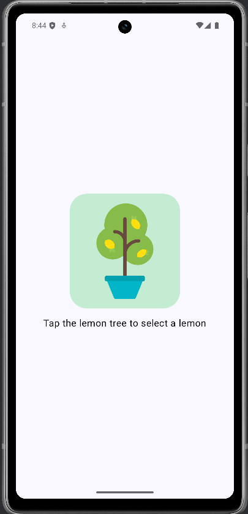
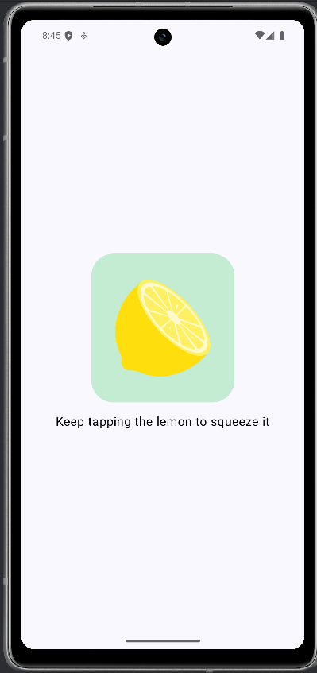
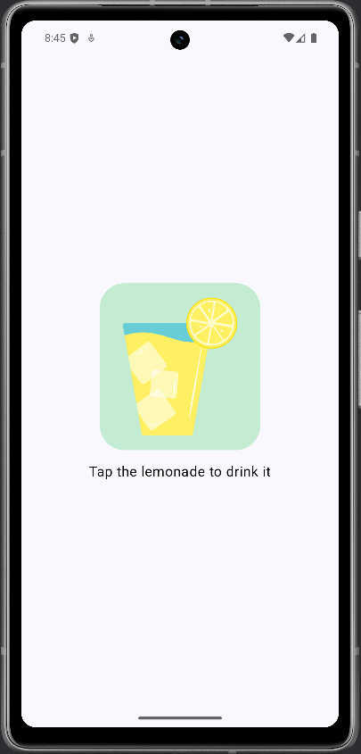
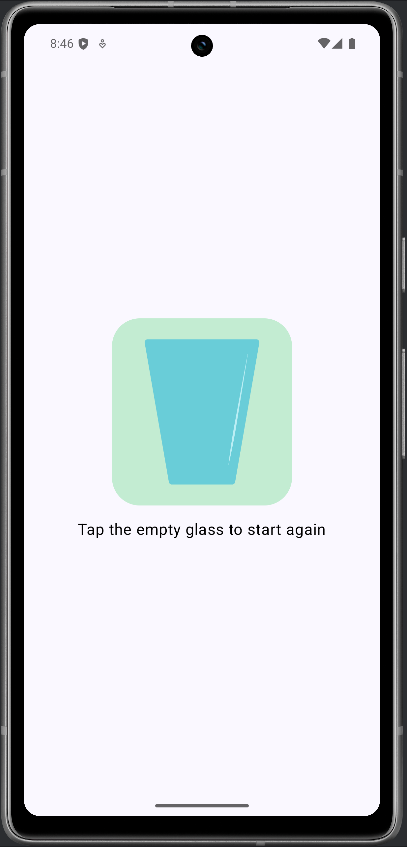

# 🍋 Lemonade App – Jetpack Compose Lernprojekt

Dieses Projekt ist Teil eines Lernpfades zu Android-Entwicklung mit **Jetpack Compose**. Die App simuliert einen einfachen Lemonade-Herstellungsprozess mit vier interaktiven Screens – vom Zitronenpflücken bis zum Genießen.

---

## 🔍 Features

- UI mit **Jetpack Compose**
- Zustandsbasiertes UI-Verhalten (State Machine mit Klicks)
- Verwendung von `remember`, `mutableStateOf` und `Image + Text` Kombination
- Resourcenhandling für Strings und Drawables

---

## 🧪 Screens & Ablauf

1. **Pflücke eine Zitrone** 🍋  
   Klick auf den Zitronenbaum → Weiter zur nächsten Phase.

2. **Presse die Zitrone** ✊  
   Zufällige Anzahl an Klicks nötig (2–4) → Saft wird gepresst.

3. **Trinke die Limonade** 🥤  
   Klick auf das Glas → Limo wird "getrunken".

4. **Starte neu** 🔁  
   Klick auf leeres Glas → App startet von vorn.

---

## 🛠️ Technologien & Tools

- Kotlin
- Android Studio
- Jetpack Compose
- Compose Material Design Components

---

## 🚀 Getting Started

1. Projekt in Android Studio öffnen.
2. Emulator oder echtes Gerät starten.
3. Ausführen via "Run App" ▶️

---

## 🎯 Lernziele

- Grundlagen von **State** und **Event Handling** in Compose
- Aufbau von klickbasierten Interaktionen
- Verstehen von Compose-Layouts und Ressourcenbindung

---

## 🤓 Inspiration

Basierend auf dem offiziellen [Android Codelab: Build a Lemonade App](https://developer.android.com/codelabs/basic-android-kotlin-compose-lemonade)  
Teil der Android Basics with Compose Reihe von Google.

---

## 📸 Screenshot
|Lemonade Tree | Lemonade Squeeze | Lemonade Drink | Lemonade Empty / Restart | 
|---|---|---|---|
|||||

---

## 👤 Autor

Erstellt von: *Dietmar Eisner*  
Zweck: Lernprojekt - Jetpack Compose verstehen & anwenden.
