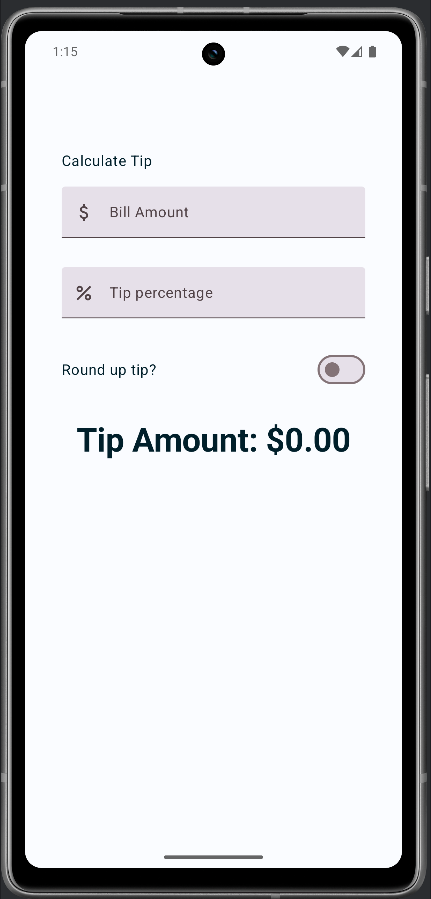

# 💰 Tip Time App

Dies ist mein Jetpack Compose Projekt, entwickelt im Rahmen der [Android Basics in Kotlin - Compose Reihe von Google](https://developer.android.com/codelabs/basic-android-kotlin-compose-using-state).

## 🚀 Ziel

Die App ermöglicht es, das passende Trinkgeld für eine Rechnung zu berechnen – einfach, modern und benutzerfreundlich. Nutzer und Nutzerinnen können einen Betrag eingeben, den Trinkgeld-Prozentsatz anpassen und wählen, ob das Ergebnis aufgerundet werden soll.

## 🛠️ Verwendete Technologien

- **Jetpack Compose** für deklarative UI-Entwicklung
- **Material 3 Komponenten** (TextField, Switch, Text, Icon, Scaffold)
- **State Management** mit `remember` und `mutableStateOf`
- **Responsive Layout** mit `Column`, `Row` und `Modifier`
- **Eingabevalidierung** und dynamisches UI-Update
- **Rundungslogik** mit `kotlin.math.ceil()`
- **Währungsformatierung** mit `NumberFormat.getCurrencyInstance()`

## 🧪 Automatisierte Tests
Die App wurde mit einem Fokus auf Testbarkeit entwickelt. Dafür kommen sowohl Unit Tests als auch UI-Tests mit Jetpack Compose zum Einsatz:

### ✅ Unit Tests (Geschäftslogik)
Die Berechnung der Trinkgeldhöhe basiert auf einer eigenen Funktion calculateTip(...), die in einem separaten Unit Test überprüft wird:

```Kotlin
@Test
fun `calculate tip 20 percent no roundup`() {
    val amount = 10.00
    val tipPercent = 20.00
    val expectedTip = NumberFormat.getCurrencyInstance().format(2)
    val actualTip = calculateTip(amount, tipPercent, roundUp = false)
    assertEquals(expectedTip, actualTip)
}

```

### 👁️ UI-Tests (Compose UI Testing)
Mit `createComposeRule()` aus dem Compose-Test-Framework wird die UI direkt getestet – realitätsnah und automatisiert:

```Kotlin
@Test
fun `calculate 20 percent tip`() {
    composeTestRule.setContent {
        TipTimeTheme {
            TipTimeLayout()
        }
    }

    composeTestRule.onNodeWithText("Bill Amount")
        .performTextInput("10")

    composeTestRule.onNodeWithText("Tip percentage")
        .performTextInput("20")

    val expectedTip = NumberFormat.getCurrencyInstance().format(2)
    composeTestRule.onNodeWithText("Tip Amount: $expectedTip")
        .assertExists("No node with this text was found.")
}

```
Diese Tests überprüfen, ob die UI korrekt auf Benutzereingaben reagiert – und geben schnelles Feedback bei Änderungen.

## 🔍 Lerneffekte

- Verständnis für Zustandsverwaltung in Compose
- Praktischer Einsatz von Composables zur UI-Erstellung
- Interaktive Eingabefelder und deren Auswirkungen auf die UI
- Strukturierung einer App mit sauberer Trennung von UI und Logik
- Einführung in **automatisierte Tests** mit Compose
- Sicherheit durch **Testabdeckung** in kleinen Compose-Projekten

## 📸 Vorschau



---

➡️ Basierend auf den offiziellen [Codelabs von Google](https://developer.android.com/codelabs/basic-android-kotlin-compose-using-state) umgesetzt.
🧪 Tests umgesetzt nach Anleitung im Codelab [Write automated tests](https://developer.android.com/codelabs/basic-android-kotlin-compose-write-automated-tests#6)

