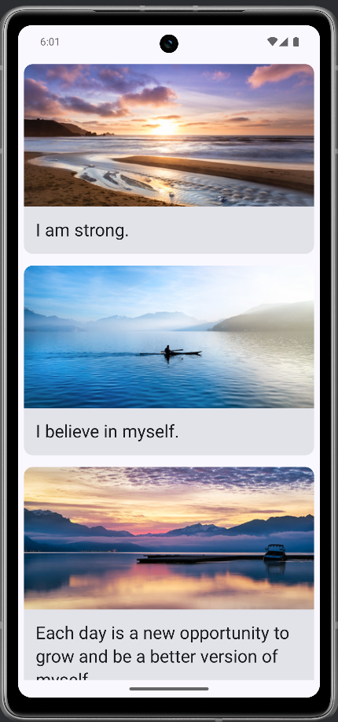

# 💬 Affirmations App

Dies ist mein Jetpack Compose Projekt, entwickelt im Rahmen des Android-Kurses:  
👉 [Android Basics with Compose - Unit 3, Pathway 1: Display a Scrollable List](https://developer.android.com/codelabs/basic-android-kotlin-compose-training-add-scrollable-list?continue=https%3A%2F%2Fdeveloper.android.com%2Fcourses%2Fpathways%2Fandroid-basics-compose-unit-3-pathway-2%23codelab-https%3A%2F%2Fdeveloper.android.com%2Fcodelabs%2Fbasic-android-kotlin-compose-training-add-scrollable-list#0)

## 🎯 Ziel des Projekts

_Ziel dieser App ist es, eine affirmierende Zitateliste mit Bildern darzustellen – durch Einsatz einer scrollbaren Liste mit Jetpack Compose._

Dabei werden zentrale Jetpack Compose- und Kotlin-Konzepte angewendet:

- Verwendung von `LazyColumn` zur Darstellung langer Listen  
- Trennung von Daten und UI durch eine `Datasource`  
- Einsatz von `@Composable`-Funktionen für modulare Komponenten  
- Dynamische Darstellung von Inhalten durch `stringResource` und `painterResource`  
- Nutzung von `Card`, `Text`, `Image` und `Column` für den UI-Aufbau  
- Anwendung des Material Design 3 Themes  

---
[⬆️](#top) [🔙](../../#unit-3)

## 🛠️ Features

- Scrollbare Liste von Affirmationskarten  
- Jede Karte enthält ein inspirierendes Zitat und ein zugehöriges Bild  
- Komplette UI mit Jetpack Compose umgesetzt  
- Nutzung von Ressourcen (Strings & Drawables)  
- Vollständig im modernen `Material3`-Look gestaltet  

---
[⬆️](#top) [🔙](../../#unit-3)

## 🧪 Lerninhalte und Erkenntnisse

- Wie man mit `LazyColumn` eine performante scrollbare Liste aufbaut  
- Strukturierung von UI-Komponenten durch wiederverwendbare `@Composable`-Funktionen  
- Arbeit mit externen Datenquellen (`Datasource`) und Modellklassen (`Affirmation`)  
- Verknüpfung von Ressourcen-IDs mit UI-Elementen  
- Styling mit `Modifier`, `padding`, `fillMaxWidth` etc.  
- Optimale Trennung von Logik, Daten und UI  

---
[⬆️](#top) [🔙](../../#unit-3)

## 📸 Screenshots

---

[⬆️](#top) [🔙](../../#unit-3)

## 🧠 **Fazit:**  
Die Affirmations-App bietet einen großartigen Einstieg in das Arbeiten mit Listen und Ressourcen in Jetpack Compose. Durch den modularen Aufbau wird die Wartbarkeit erhöht und das Projekt bietet eine solide Grundlage für komplexere, datengetriebene Compose-Anwendungen.

---

[⬆️](#top) [🔙](../../#unit-3)

