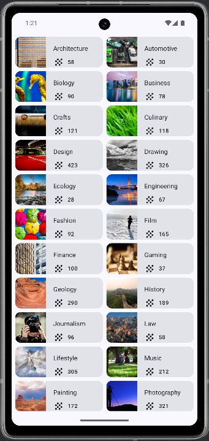

# 📚 Courses Grid App

Dies ist mein Jetpack Compose Projekt, umgesetzt im Rahmen des Android-Kurses:  
👉 [Android Basics with Compose - Unit 3, Pathway 2: Display a Grid of Items](https://developer.android.com/codelabs/basic-android-kotlin-compose-practice-grid?continue=https%3A%2F%2Fdeveloper.android.com%2Fcourses%2Fpathways%2Fandroid-basics-compose-unit-3-pathway-2%23codelab-https%3A%2F%2Fdeveloper.android.com%2Fcodelabs%2Fbasic-android-kotlin-compose-practice-grid#0)

## 🎯 Ziel des Projekts

Die App zeigt eine zweispaltige Grid-Ansicht von Kursen. Jeder Kurs enthält:

- Ein Titel (z. B. "Photography")
- Ein passendes Bild
- Die Anzahl der verfügbaren Kurse, dargestellt mit Icon & Text

---

[⬆️](#top) [🔙](../../#unit-3)

## 🛠️ Features

- Verwendung von `LazyVerticalGrid` zur Darstellung eines flexiblen Rasters  
- Visuelle Trennung durch `Arrangement.spacedBy()` für Abstände  
- Dynamisches Rendering der Kursdaten über eine eigene `DataSource`  
- Jeder Eintrag besteht aus `Card`, `Image`, `Text` und `Icon`  
- Nutzung von Ressourcen (Strings & Drawables) via `stringResource()` und `painterResource()`  
- Material Design 3 Theme für modernes, konsistentes UI  

---

[⬆️](#top) [🔙](../../#unit-3)

## 🧪 Lerninhalte und Erkenntnisse

- Wie man ein Grid statt einer klassischen Liste in Jetpack Compose aufbaut  
- Unterschiedliche `Composable`-Elemente sinnvoll kombinieren (z. B. `Row`, `Column`, `Icon`)  
- Verwendung von `Modifier` für Layoutkontrolle  
- Aufteilung und Trennung von Datenstruktur (`Topic`) und UI  
- Vorschau mit `@Preview` für schnelle Iteration im UI-Design  
- Nutzung von Material Design Komponenten und Layoutprinzipien

---

[⬆️](#top) [🔙](../../#unit-3)

## 📸 Screenshots

---

[⬆️](#top) [🔙](../../#unit-3)

## 🧠 **Fazit:**  
Die Courses Grid App zeigt eindrucksvoll, wie flexibel Jetpack Compose auch komplexere Layouts wie Grids unterstützt. Besonders der modulare Aufbau sowie die saubere Trennung von Datenmodell und Darstellung sind zentrale Konzepte, die sich auf größere Projekte übertragen lassen.

---

[⬆️](#top) [🔙](../../#unit-3)
