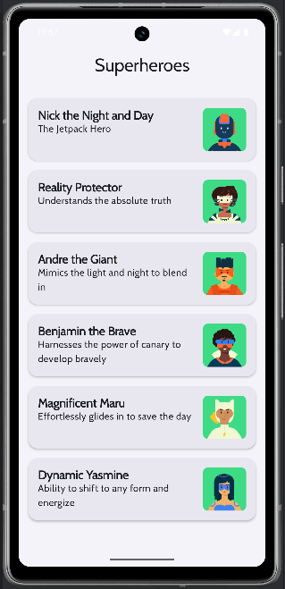
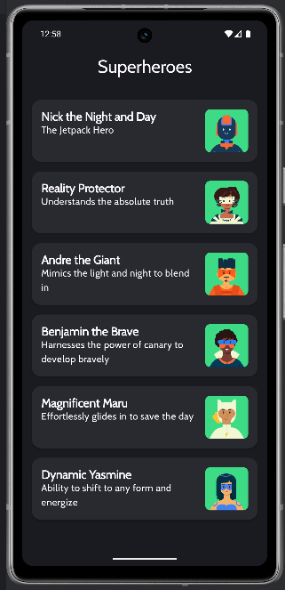

# 🦸‍♂️ Superheroes App
Dies ist mein Jetpack Compose Projekt, umgesetzt im Rahmen des Android-Kurses:
👉 [Android Basics with Compose - Unit 3, Pathway 3: Material Theming](https://developer.android.com/codelabs/basic-android-kotlin-compose-practice-superheroes?continue=https%3A%2F%2Fdeveloper.android.com%2Fcourses%2Fpathways%2Fandroid-basics-compose-unit-3-pathway-3%23codelab-https%3A%2F%2Fdeveloper.android.com%2Fcodelabs%2Fbasic-android-kotlin-compose-practice-superheroes#0)

## 🎯 Ziel des Projekts
Die App zeigt eine Liste von Superhelden mit Bild, Name und Beschreibung.
Ziel ist es, Material Design 3 mit modernen UI-Komponenten wie Cards und LazyColumn zu kombinieren und eine ansprechende, scrollbare Listenansicht zu realisieren.

---

[⬆️](#top) [🔙](../../#unit-3)

## 🛠️ Features
- Verwendung von LazyColumn zur effizienten Darstellung einer scrollbaren Liste
- Gestaltung der UI mit Card, Row, Column, Box und Image
- Einbindung von Bild- und Textressourcen über painterResource() und stringResource()
- Nutzung von Material Design 3 Komponenten und Themes für ein konsistentes Look & Feel
- Implementierung einer TopAppBar zur klaren Navigation und Branding
- Saubere Trennung von UI, Daten und Theme-Komponenten für bessere Wartbarkeit

---

[⬆️](#top) [🔙](../../#unit-3)

## 🧪 Lerninhalte und Erkenntnisse
- Vertieftes Verständnis von Compose-Layouts und Material3 UI-Elementen
- Aufbau wiederverwendbarer Composables mit klar definierten Parametern
- Umgang mit Ressourcen in Compose, inklusive String- und Bildressourcen
- Anwendung von Modifier für flexible Layoutgestaltung und responsive Design
- Nutzung von Preview-Funktionen zur schnellen UI-Entwicklung und -Iteration

[⬆️](#top) [🔙](../../#unit-3)

## 📸 Screenshots
|Light Theme	| Dark Theme |
|---|---|
| |  |

---

[⬆️](#top) [🔙](../../#unit-3)

## 🧠 Fazit:
Die Superheroes App zeigt, wie man mit Jetpack Compose und Material Design 3 eine moderne, performante und ansprechende Listen-App baut. Das Projekt demonstriert praxisnah, wie man UI, Daten und Themes sauber trennt und eine konsistente Nutzererfahrung schafft.

---

[⬆️](#top) [🔙](../../#unit-3)