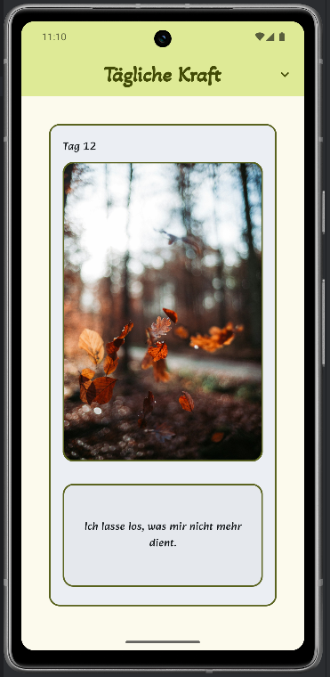
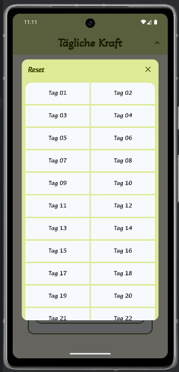
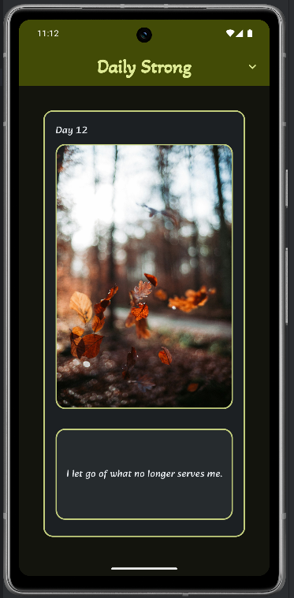

# 📚 Thirty Days App (Daily Strong)

Dies ist mein Jetpack Compose Projekt, umgesetzt im Rahmen des Android-Kurses:  
👉 [Android Basics with Compose - Unit 3, Project: 30 Days App](https://developer.android.com/codelabs/basic-android-kotlin-compose-30-days?continue=https%3A%2F%2Fdeveloper.android.com%2Fcourses%2Fpathways%2Fandroid-basics-compose-unit-3-pathway-3%23codelab-https%3A%2F%2Fdeveloper.android.com%2Fcodelabs%2Fbasic-android-kotlin-compose-30-days#0)

## 🎯 Ziel des Projekts

Die App zeigt täglich eine positive Affirmation aus einer Liste mit dazugehörigem Bild an.  

- Eine neue Affirmation wird jeden Tag automatisch angezeigt  
- Über das Action Icon in der TopAppBar kann man den Tag manuell auswählen, um andere Affirmationen zu sehen (zur Ansicht, die Auswahl wird beim Neustart zurückgesetzt)  
- Man kann den Tageszähler manuell zurücksetzen, um zur aktuellen Affirmation zurückzukehren  

---

[⬆️](#top) [🔙](../../#unit-3)

## 🛠️ Features

- Dynamische Anzeige von Affirmationen mit Bild und Text  
- Verwendung von `LazyColumn` für die Darstellung einer scrollbaren Liste  
- UI-Strukturierung mit `Card`, `Column`, `Image` und `Text`  
- Ressourcenbilder aus `drawable` werden via `painterResource` eingebunden  
- Nutzung von `items()` in Compose für dynamisches Rendering  
- Manuelle Auswahl des Tages über ein Action Icon in der TopAppBar  
- Möglichkeit, den Tageszähler manuell zurückzusetzen  
- Verwendung von Material Design 3 Komponenten und Themes für ein modernes Design  

---

[⬆️](#top) [🔙](../../#unit-3)

## 🧪 Lerninhalte und Erkenntnisse

- Aufbau von UI mit `@Composable`-Funktionen  
- Arbeiten mit `LazyColumn` für performante und flexible Listen  
- Umgang mit Ressourcen in Compose (`stringResource` & `painterResource`)  
- Integration von Material Design 3 und Themes für konsistentes Design  
- State Management: Darstellung einer sich täglich ändernden Ansicht mit Möglichkeit zur manuellen Steuerung  
- Umgang mit UI-Events und Nutzerinteraktion (TopAppBar Action Icon, Reset-Funktion)  

---

[⬆️](#top) [🔙](../../#unit-3)

## 📸 Screenshots

  
_Affirmation des Tages mit passendem Bild_

  
_Manuelle Auswahl eines anderen Tages über das TopAppBar Icon_

  
_Die App wie Sie im Dark Mode und auf Englisch aussieht_

---

[⬆️](#top) [🔙](../../#unit-3)

## 🧠 **Fazit:**  
Die ThirtyDaysApp ist ein tolles Beispiel, wie man Jetpack Compose nutzt, um eine einfache, aber wirkungsvolle App mit dynamischem Inhalt zu erstellen. Besonders spannend ist das Tages-Prinzip mit automatischer Änderung und manueller Steuerung – eine einfache Idee, die viel Nutzerfreundlichkeit bietet. Die saubere Trennung von UI, Daten und Themes macht die App robust und gut erweiterbar.

---

[⬆️](#top) [🔙](../../#unit-3)
