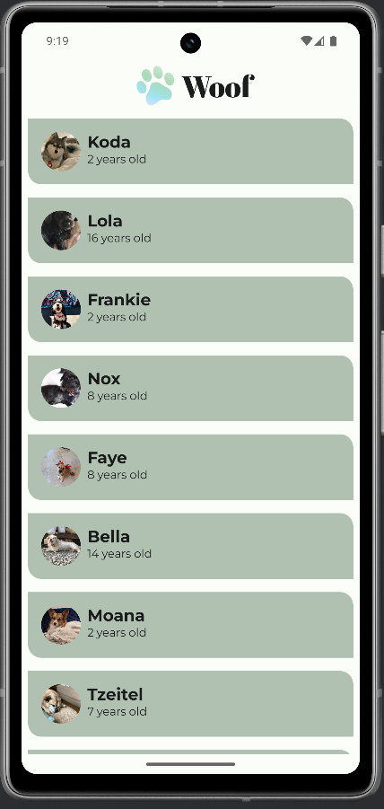
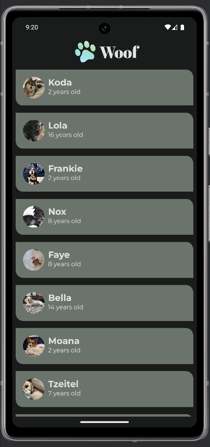

# 🐾 Woof App

Dies ist mein Jetpack Compose Projekt, umgesetzt im Rahmen des Android-Kurses:  
👉 [Android Basics with Compose - Unit 3, Pathway 3: Material Theming](https://developer.android.com/codelabs/basic-android-kotlin-compose-material-theming)

## 🎯 Ziel des Projekts

Die App zeigt eine Liste von Hunden mit Bild, Name und Alter.  
Ziel ist es, Material Design 3 mit Themes, Cards und LazyColumn zu kombinieren und eine moderne UI aufzubauen.

---

[⬆️](#top) [🔙](../../#unit-3)

## 🛠️ Features

- Verwendung von `LazyColumn` zur Darstellung einer scrollbaren Liste  
- Nutzung von `Card`, `Row`, `Column` und `Image` zur UI-Struktur  
- Einbindung von Ressourcen (Strings & Drawables) via `stringResource()` und `painterResource()`  
- Implementierung eines eigenen Material Design 3 Themes mit Light- und Dark-Varianten  
- Modulare Trennung von Datenmodell, UI und Theme  
- Edge-to-Edge Darstellung und TopAppBar  

---

[⬆️](#top) [🔙](../../#unit-3)

## 🧪 Lerninhalte und Erkenntnisse

- Umgang mit Compose-Layouts und Material3 Komponenten  
- Erstellen von wiederverwendbaren Composables  
- Aufbau eines konsistenten Themes mit Color.kt und Theme.kt  
- Arbeiten mit Ressourcen und Dimensionen  
- Nutzung von Preview-Funktionen für schnelle UI-Iteration

---

[⬆️](#top) [🔙](../../#unit-3)

## 📸 Screenshots
|Light|Dark|
|---|---|
|||

---

[⬆️](#top) [🔙](../../#unit-3)

## 🧠 **Fazit:**  
Die Woof App zeigt, wie sich mit Jetpack Compose Material3 ein modernes UI mit dynamischen Listen und eigenem Design realisieren lässt. Besonders das Zusammenspiel von Theme, Ressourcen und Layout wird hier praxisnah demonstriert.

---

[⬆️](#top) [🔙](../../#unit-3)
